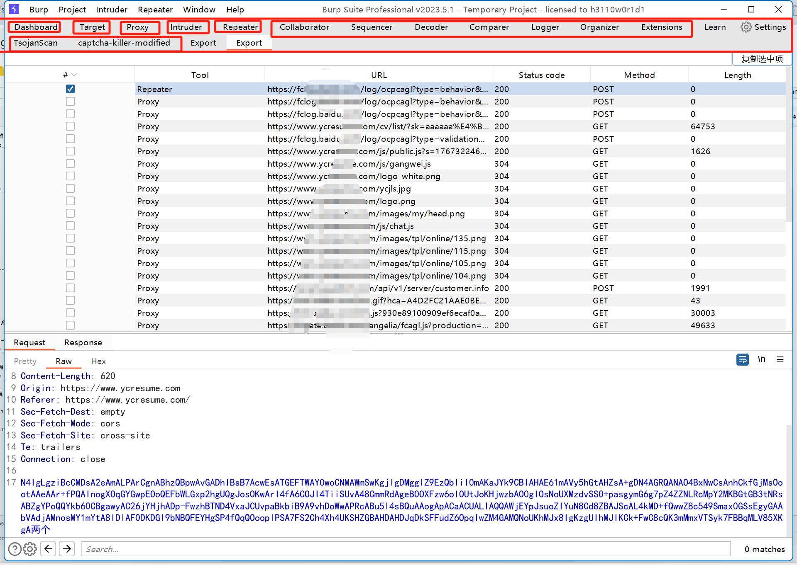

# burp_ai_scan
它通过分析 HTTP 请求/响应数据，结合预训练的 AI 模型，识别传统规则无法发现的复杂安全漏洞（如逻辑漏洞、业务层攻击面等）


## 下载
1.右方 Releases处,下载Export.jar和burp_ai_scan文件夹压缩包,并解压

2.将 阿里云百炼的API Key 加入 系统环境变量(参考阿里云百炼网站文档详情)


3.进入burp_ai_scan文件夹 执行
```
pip install -r requirements.txt
```


注:Export.jar是 jdk11及以上可以使用 burp_ai_scan是Python 3.5及以上可以使用


## 快速开始

1.将  Export.jar手动导入 burp extensions

2.该插件记录 burp 所有流量包,搜索可能含有漏洞的数据包并选中,点击复制选中框


3.将数据粘贴至 burp_AI_scan文件夹的1.txt

4.执行 
```
python burp_ai_scan.py -r 1.txt
```


5.输出
```
漏洞类型：
双引号联合 SQL 注入

Payload：
demo.name"%20FROM%20sqlite_master--

WAF绕过：
未检测出WAF
```

## Export.jar与TsojanScan联合使用方式:

1.将可以数据包发送给 TsojanScan 进一步测试


2.Export插件 获取到TsojanScan的数据(也可搜索url)


3.选择要复制的请求包和返回包,点击复制选中项

4.将数据粘贴至burp_ai_scan文件夹的1.txt 

5.执行python burp_ai_scan.py -r 1.txt


## Export的5大功能
1.日志:记录来自burp 所有模块流量的数据包


2.复制:可将 多个数据包 一起复制,格式为 请求包1:... 返回包1:... 请求包2:... 返回包2:.. 适合AI分析数据包,可用于个人AI研究的prompt


3.排序:可将 Export.jar 界面的列选项 排序,可排序后查看已选中的复选框


4.搜索功能:搜索关键字


## 原创:公众号-小安全sec

